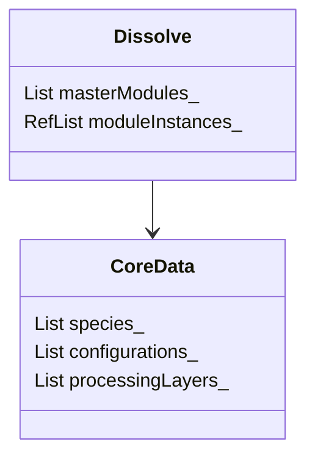

# Architecture

## Introduction

### Purpose
This document outlines the basic operation of the Dissolve code, covering initialisation and processing steps.

### Scope
This document introduces the main stages of operation of Dissolve, describing each step in detail, and is primarily useful for developers and contributors who wish to understand the basic workflow utilised by the code.

## Definitions

- _Species_: An atomic, molecular, or other component present in the experimental system
- _Configuration_: A representation of an experimentally-measured system, comprising atoms at specific positions, the chemical bonds between them, and the _species_ that they represent. 
- _Module_: A processing object which calculates one or more useful quantities, from zero or more configurations.
- _Processing Layer_ or simply _Layer_: A collection of _modules_, in a specific order, that when run in sequence result in output useful to the user.
- _Forcefield_: A collection of terms describing the interactions between atoms within and between _species_ within a _configuration_.
- _Simulation_: The entire process that Dissolve performs, utilising _configurations_ of _species_, the _forcefield_, and _processing layers_ of _modules_.

## Overview

The primary use case of Dissolve is to help interrogate experimental data through the use of various classical simulation techniques. Typically, scattering measurements will have been made on some target system of interest (a liquid, solid, glass etc.) and so experimental structural data describing the system in some way is available. The purpose of Dissolve is to replicate these target data from a supplied set of one or more configurations through the application of classical atomistic simulation techniques (encapsulated within individual modules).

Since the nature, size, and content of the experimentally-measured systems is by nature extremely varied, Dissolve does not assume any default style of simulation to apply. Instead, individual modules (encapsulating specific calculations or algorithms) are assembled in to processing layers in order to create a suitable simulation and analysis pipeline for the systems under study. There are several general simulation styles that are considered "common usage" and so templates for these types of processing layers are provided.

## Relevant Classes

- [Dissolve](https://github.com/trisyoungs/dissolve/tree/develop/src/main/dissolve.h)
- [CoreData](https://github.com/trisyoungs/dissolve/tree/develop/src/classes/coredata.h)

## Class Dependency

## Implementation

The main Dissolve class takes a reference to a `CoreData` object in its constructor, and which stores configuration, species, and processing layer definitions, as well as some forcefield-related terms. `Dissolve` does not own the `CoreData` object itself, since it is useful to able to transfer the `CoreData` reference through the code, without unnecessary baggage.

