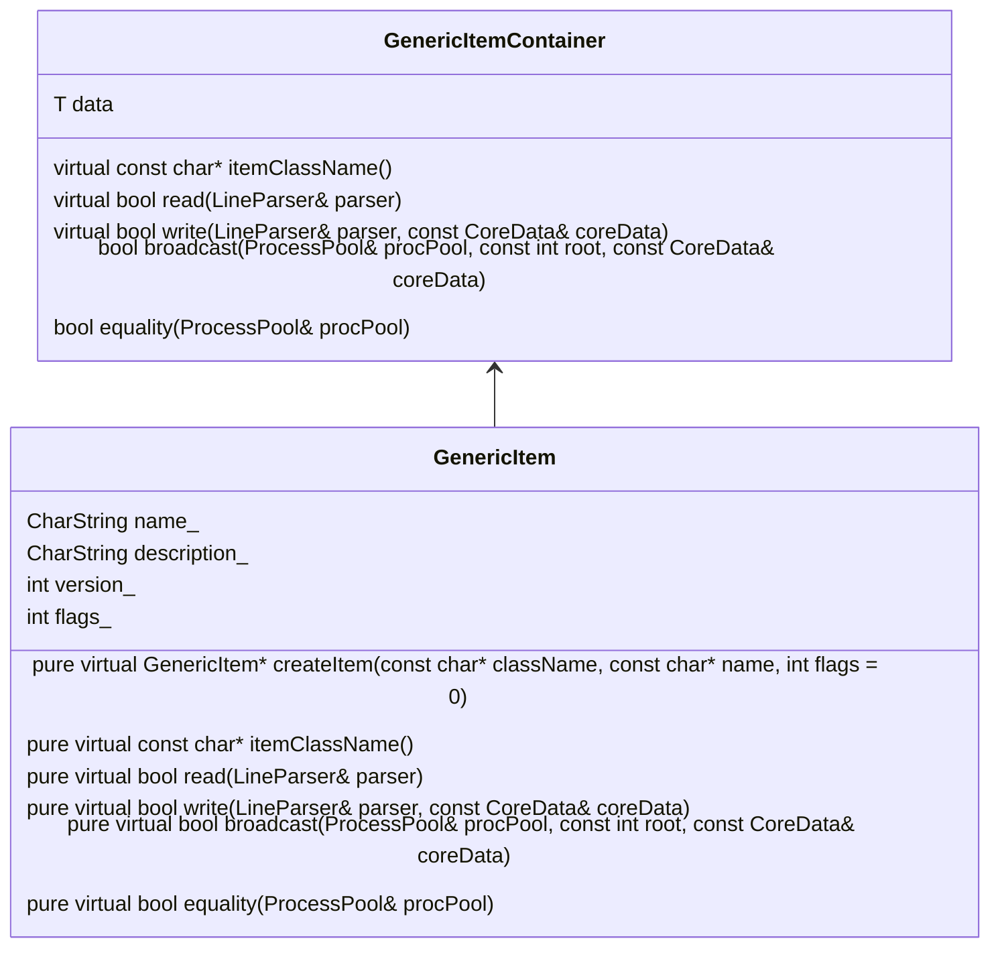

# Data Management

## Introduction

### Purpose
This document gives an overview of the handling (storage, retrieval, I/O) of generic data within Dissolve.

### Scope
This overview provides implementation details on data storage and management techniques used with the Dissolve code, presenting the salient design decisions, architectures, and classes relevant to its implementation. The document is suitable for developers wishing to understand, modify, fix, or otherwise extend the code.

### Definitions


## Overview

### Brief

The core functionality of Dissolve is contained within independent [modules](Modules.md), which may run in any order. Each module typically creates useful data that are of interest to the user (e.g. calculations which yield some specific property of interest), to other modules (which take pre-existing data and use it as the basis for other calculations), or which is necessary to store in order to permit a successful restart of the simulation (i.e. historic data used when performing averaging). These data may be PODs, opaque classes, or templated objects.

### Rationale

Storage of these data locally within the modules itself and providing standard accessors is undesirable since this requires that modules requiring data stored in another module must know the address and relevant member accessor function to retrieve it, increasing the interface complexity as well as the fragility between (strictly independent) modules. Instead, data are stored in a type-agnostic container class, tagged with a descriptive name in order to permit retrieval. These containers are used as centralised repositories (located in the main `Dissolve` class or locally in configurations) for data created during the main simulation loop

This 'blackboard-style' approach to the storage of data has the following benefits:
1. 'Useful' data is localised in specific places, rather than being stored locally within module instances, and so can be easily transferred around the code as is necessary.
1. Modules may implement different algorithms in order to calculate the same (named) data, and which can then be accessed by other modules without requiring knowledge of the exact nature of the creating module.
1. Data relevant to the restarting / continuation of simulations is contained in a single area outside of any modules, greatly simplifying the creation and loading of restart files.
1. Since the sequence of modules to be executed is not known _a priori_, the lack of availability of a named piece of data is meaningful, and eliminates the need to check for specific module types having already been executed and their data prepared and available for others to use.

## Implementation

### Relevant Classes

- [GenericList](https://github.com/trisyoungs/dissolve/tree/develop/src/genericitems/list.h)
- [GenericListHelper](https://github.com/trisyoungs/dissolve/tree/develop/src/genericitems/listhelper.h) (template)
- [GenericItem](https://github.com/trisyoungs/dissolve/tree/develop/src/genericitems/item.h)
- [GenericItemContainer](https://github.com/trisyoungs/dissolve/tree/develop/src/genericitems/container.h) (template)
- [GenericItemBase](https://github.com/trisyoungs/dissolve/tree/develop/src/genericitems/base.h)
- [LineParser](https://github.com/trisyoungs/dissolve/tree/develop/src/base/lineparser.h)
- [CoreData](https://github.com/trisyoungs/dissolve/tree/develop/src/classes/coredata.h)

### Core Container Class

The `GenericItemContainer` is a template with single class parameter `T`, and derives from the non-template `GenericItem` class as follows to form the basic storage container:



`GenericItem` defines the basic interface required for any object to be committed to our data store, and provides a common base to all templated containers in order to allow congruent list storage and searching. Necessarily `GenericItem` contains a handful of pure `virtual` functions providing read/write capability for the data, as well as some related to data transfer when running in parallel (the `broadcast()` and `equality()` member functions). Generic implementations of all four of these functions are provided by `GenericItemContainer<T>` which simply assumes the presence of functions with identical signatures in `T data_`. For PODs this of course is not the case, and so template specialisations are written for each relevant POD (see, for instance, the specialisation for [`bool`](https://github.com/trisyoungs/dissolve/tree/develop/src/genericitems/bool.h)). Classes that are to be stored within a `GenericItemContainer` must 

```C++

```

that must be implemented by any class cont


TODO Static members in GenericItem for registering available types.
For a POD

### Class Dependen

The primary storage class for Dissolve's type-agnostic data is the `GenericList`.

TODO Class Dependency
TODO Mechanism for opaque classes
TODO Template specialisations for PODs
