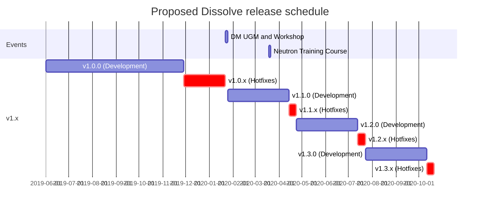

# Release Cycle

## Introduction

### Purpose
This document defines the versioning and release cycle intended for the Dissolve project.

### Scope
This document describes and defines the release cycle and versioning for the Dissolve project in more detail, suitable for users, contributors, and developers.

## Overview

Dissolve is a scientific code with a well-defined underlying framework (which is likely to change slowly) upon which specific functionality is added in a [modular manner](overviews/modules.md). As such, the development cycle is likely to be fairly rapid. For these reasons, a three-month release cycle will be undertaken in the first instance, beginning from `version 1.0` planned for January 2020.

Development priorities for each incremental version will be decided by the [project management committee](../governance/pmc.md).
