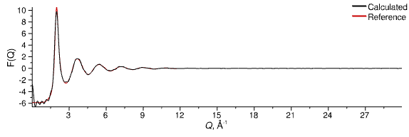

# Liquid Argon

## 5) Equilibrate the System

With two of our processing layers set up we can start to run the simulation and monitor how the system is evolving. There are several ways to run the simulation within the Dissolve GUI.

> Click the _Run_{: .text-green-100} button on the left-hand side of the main window
{: .action .action_mouse}
> Simulation &#8680; Run
{: .action .action_menu}
> Ctrl-R
{: .action .action_key}

Do one of those to set the simulation running. Note the counter in the top-left of the main window which tracks the current iteration.

While the simulation is running you cannot edit any input values, keywords etc., but you can investigate the simulation's progress and output as it happens. For example, you could go to your _Standard Atomic (MC/MD)_ evolution layer and double-click the [`Energy`](../../userguide/modules/energy) module to see a plot of the total energy of the configuration.

If you have the [`NeutronSQ`](../../userguide/modules/neutronsq) module tab still open (if you don't, go back to your _RDF and Neutron S(Q)_ layer and double-click on the [`NeutronSQ`](../../userguide/modules/neutronsq) module) you can see how the calculated structure factor and total G(r) compare to the experimental data we loaded in. After the simulation has been running for a little while (perhaps 100 iterations), you'll see that the simulation and experiment actually compare quite favourably, with the G(r) and F(Q) looking something like this:

{: .img-centre}
*Equilibrated total G(r) for liquid argon*
{: .img-centre}
*Equilibrated total F(Q) for liquid argon*

We'll now stop the simulation.

> Click the _Pause_{: .text-green-100} button on the left-hand side of the main window
{: .action .action_mouse}
> Simulation &#8680; Pause
{: .action .action_menu}
> Esc
{: .action .action_key}

Keep in mind that the simulation will not actually stop until the current iteration is completed - most parts of the GUI will remain grayed out until then.

[Previous Step](step4b.md){: .btn }   [Next Step](step6.md){: .btn .right}
