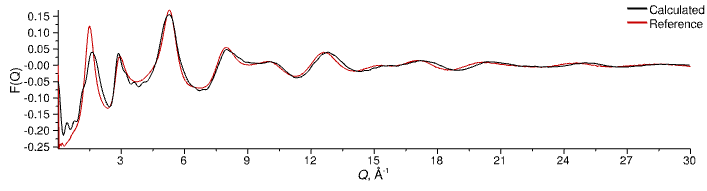

# Bulk Silica

30 minute read
{: .label .label-blue }

## Summary

Amorphous silica (SiO2) is found in a variety of places, and is a relatively simple, network forming glass. Here we'll set up a bulk silica simulation in a unit cell of our own design, and which can serve as the basis for other tutorials.

## Preparation

Download the example data file archive `Dissolve-X.Y.Z-ExampleData.zip` or `Dissolve-X.Y.Z-ExampleData.tar.gz` (where `X.Y.Z` will be the current version) from the [continuous build](https://github.com/trisyoungs/dissolve/releases/tag/continuous) in the releases section on GitHub if you haven't done so already.

> Open the Dissolve GUI
{: .action .action_dissolve}
> Choose **Empty Simulation** from the _Create_ section
{: .step}
> Save As...
{: .action .action_menu}
> Save your own input file under a sensible name in the `silica_bulk` directory of the example data
{: .step}

Alternatively, download the data files listed below and save them to your location of choice.

- Neutron data file: [SiO2_NIMROD.mint01](https://raw.githubusercontent.com/trisyoungs/dissolve/develop/examples/silica_bulk/data/SiO2_NIMROD.mint01)

[Let's begin!](step1.md){: .btn}

## 1. Set up Atomic Species

Somewhat obviously, we need two atomic species for this simulation - an oxygen, and a silicon. First, however, we'll create some suitable atom types by hand.

> **Forcefield** tab, **Atom Types** section
{: .action .action_tabs}
> Click the _[+] Add_{: .text-green-100} button located at the top-right
{: .step}
> Select silicon in the periodic table dialog
{: .step}
> Change the _Charge_ of the new atom type to `2`, the _SR Form_ to `LJ`, _Parameter 1_ (Lennard-Jones epsilon) to `0.175`, and _Parameter 2_ (Lennard-Jones sigma) to `1.03`
{: .action .action_edit}
> Click the _[+] Add_{: .text-green-100} button again, and choose oxygen from the periodic table
{: .step}
> Change the _Charge_ of the oxygen atom type to `-1`, the _SR Form_ to `LJ`, _Parameter 1_ (Lennard-Jones epsilon) to `0.165`, and _Parameter 2_ (Lennard-Jones sigma) to `3.5`
{: .action .action_edit}

> Atom types created in this way are named after the symbol of the relevant element.
{: .tip}
	
Now let's generate our atomic species, assign the relevant atom types, and create a basic site for each. First, the silicon:

> Species &#8680; Create... &#8680; Atomic...
{: .action .action_menu}
> Select silicon from the periodic table
{: .step}
> **Si** species tab, **Contents & Forcefield** section
{: .action .action_tabs}
> In the list of _Atoms_ change the _AtomType_ for the atom to `Si`
{: .step}
> **Si** species tab, **Sites** section
{: .action .action_tabs}
> Select the silicon atom in the viewer, and click _Create_ in the toolbar to create a site
{: .step}

And now, the oxygen:

> Species &#8680; Create... &#8680; Atomic...
{: .action .action_menu}
> Select oxygen from the periodic table
{: .step}
> **O** species tab, **Contents & Forcefield** section
{: .action .action_tabs}
> In the list of _Atoms_ change the _AtomType_ for the atom to `O`
{: .step}
> **O** species tab, **Analysis Sites** section
{: .action .action_tabs}
> Select the oxygen atom in the viewer, and click _Create_ in the toolbar to create a site
{: .step}

[Back to Overview](index.md){: .btn }   [Next Step](step2.md){: .btn .right}
## 2. Set up a Configuration

To create our silica configuration we'll use the "relative random mix" generator as a basis.

> Configuration &#8680; Create... &#8680; Relative random mix
{: .action .action_menu}
> Choose both the silicon and the oxygen species and continue
{: .step}
> Double-click the new configuration tab and rename it to `Bulk`
{: .action .action_edit}

Let's set-up the parameters in the generator first of all. The relative random mix uses the population of the first species (referred to as `A`) as the reference, and sets the population of all other species relative to the first, based on user defined ratios. So, here we will use the silicon species as `A` and set its population explicitly, and set the relative population of species `B` (the oxygen) to be twice that of `A`, thus giving us SiO2.

> Open the settings for the `Parameters` node
{: .action .action_settings}
> Change the value of the integer `populationA` variable to 1500.
{: .action .action_edit}
> Set `ratioB` to 2
{: .action .action_edit}

The density of bulk, amorphous silica is 0.0664 atoms &#8491;-3. We use units of atoms &#8491;-3 here as this allows us to add both atomic components using the same density value. If we had chosen units of g cm3 we would have to know the individual densities of silicon and oxygen in amorphous silica.

> Change the value of the real `rho` variable to 0.0664.
{: .action .action_edit}

Next, the box. We will still use relative lengths and scale the box according to our species population and density, but we will create a monoclinic box rather than a cubic one:

> Open the settings for the `Box` node
{: .action .action_settings}
> Set the angle _&#945;_ to 120 degrees
{: .action .action_edit}

Finally, we just need to check the ordering of the species in the `AddSpecies` nodes.

> Open the settings for the first `AddSpecies` node
{: .action .action_settings}
> Make sure that the target _Species_ is `Si`
{: .step}
> Open the settings for the second `AddSpecies` node
{: .action .action_settings}
> Make sure that the target _Species_ is `O`
{: .step}

We're all set up, so click **Regenerate** to recreate the box using our new parameters.

[Previous Step](step1.md){: .btn }   [Next Step](step3.md){: .btn .right}
## 3. Set up Processing

Let's create two processing layers now - one to evolve our configuration, and one to calculate the current RDFs and structure factors.

We have only atomic species, so we'll choose the basic atomic evolution layer for our system:

> Layer &#8680; Create... &#8680; Evolution... &#8680; Atomic (MC only)
{: .action .action_menu}

Our reference data is neutron-weighted so:

> Layer &#8680; Create... &#8680; Calculate... &#8680; RDF and Neutron S(Q)
{: .action .action_menu}

We just need to set the instrumental _Q_ broadening and add the reference data to our [`NeutronSQ`](../../userguide/modules/neutronsq) module:

> Click on the [`NeutronSQ`](../../userguide/modules/neutronsq) module to display its options
{: .action .action_mouse}
> Open the **Calculation** settings group
{: .action .action_groups}
> Set the **QBroadening** to `OmegaDependentGaussian` with a FWHM of 0.03
{: .step}
> Open the **Reference Data** settings group
{: .action .action_groups}
> For the **Reference** keyword select the file `SiO2_NIMROD.mint01` and set the format of the data to `mint`
{: .step}
> The datafile contains a point at _Q_ = 0.0 which we must remove, so tick the **ReferenceIgnoreFirst** option
{: .step}

[Previous Step](step2.md){: .btn }   [Next Step](step4.md){: .btn .right}
## 4. Equilibrate the Box

To ensure that our silicon and oxygen atoms are well mixed and distributed we're going to "cook" the box at a high temperature to start with.

> **Bulk** configuration tab
{: .action .action_tabs}
> Change the **Temperature** to 2000.0
{: .action .action_edit}

Now we'll run for 250 steps

> Simulation &#8680; Run For...
{: .action .action_menu}
> Set the number of steps to 250 and click _OK_
{: .step}

You can open (double-click) the [`NeutronSQ`](../../userguide/modules/neutronsq) module in the _RDF / Neutron S(Q)_ layer to monitor the structure, or the [`Energy`](../../userguide/modules/energy) module in the _Evolve (Basic Atomic)_ to check the energy as the simulation progresses. The total energy will be large and negative - of the order of &ndash;4&mult;106. When finished, the F(Q) and G(r) should look a little like this:

_Calculated structure factor (black line) of amorphous silica at high temperature (2000 K) compared to reference data at 298 K (red line)_

_Calculated total G(r) (black line) of amorphous silica at high temperature (2000 K) compared to Fourier transform of reference data at 298 K (red line)_

We'll now reset the temperature of the box to 298 K and run a second equilibration.

> **Bulk** configuration tab
{: .action .action_tabs}
> Change the **Temperature** to 298.0
{: .action .action_edit}
> Simulation &#8680; Run For...
{: .action .action_menu}
> Set the number of steps to 250 and click _OK_
{: step}

Once finished, the structure should look a lot better:

_Equilibrated structure factor (black line) of amorphous silica compared to reference data at 298 K (red line)_

_Equilibrated total G(r) (black line) of amorphous silica compared to Fourier transform of reference data at 298 K (red line)_

[Previous Step](step3.md){: .btn }   [Next Step](step5.md){: .btn .right}
## 5. Refine the Structure

Add the standard [`EPSR`](../../userguide/modules/epsr) refinement layer to your simulation:

> Layer &#8680; Create... &#8680; Refinement... &#8680; Standard EPSR
{: .action .action_menu}

Double-click the [`EPSR`](../../userguide/modules/epsr) module to open it up as a tab - it's always useful to see the various overview graphs it provides.  We'll need to set a relatively high starting value for **EReq** as we are basically dealing with point charges in a box, and so whatever empirical potential is necessary to drive the structure of the system needs to grow large enough to have some effect against the strong Coulombic forces present.

> **EPSR** module tab
{: .action .action_tabs}
> Open the **Calculation** settings group
{: .action .action_groups}
> Set **EReq** to 50.0
{: .step}

On the _R-Factor_ tab of the [`EPSR`](../../userguide/modules/epsr) module you will see that the magnitude of the potential (top graph) increases rather quickly to 50 (within 100 steps in the plot below), but the quality of fit as measure by the r-factor (bottom graph) takes rather longer to reach a steady state.

_Evolution of empirical potential magnitude (max = 50.0)_

_Evolution of r-factor (EReq max = 50.0)_

The structure factor of the system at this point looks something like this:

_Stable structure factor at EReq = 50.0_

The question is, can it be better? The answer is, of course, yes - the intensity of the first strong peak in the F(Q) at 1.47 &#8491; is a little low. The empirical potential will eventually sort this out (perhaps with an increase of **EReq** to 75 or so) but it takes time to get it exactly right.

> What does the peak at _Q_ = 1.47 &#8491; correspond to, and why might it be difficult to reproduce?
{: .question}

For the purposes of the example, let's move on and calculate something from the (semi-) refined structure.

[Previous Step](step4.md){: .btn }   [Next Step](step6.md){: .btn .right}
## 6. Analyse the Structure

We'll introduce another anlaysis module, [`CalculateAngle`](../../userguide/modules/calculateangle), to finish off this tutorial. [`CalculateAngle`](../../userguide/modules/calculateangle) is similar to [`CalculateDAngle`](../../userguide/modules/calculatedangle), but is more flexible, assumes less about the connectivity between the sites, and gives more comprehensive output. We'll use it to calculate the Si&ndash;O&ndash;Si angle, and the correlations of that angle with the individual Si&ndash;O bonds.

Create an empty layer, and add a copy of the [`CalculateAngle`](../../userguide/modules/calculateangle) module to it.

> Layer &#8680; Create... &#8680; Empty
{: .action .action_menu}
> Show the module palette for the layer by clicking the _Show Palette_{: .text-green-100} button at the top left of the tab
{: .action .action_mouse}
> Drag a [`CalculateAngle`](../../userguide/modules/calculateangle) module from the `Analysis` group in the _Module Palette_{: .text-green-100} on the left
{: .step}

Now let's set it up.

> Select the [`CalculateAngle`](../../userguide/modules/calculateangle) module to display its options
{: .action .action_mouse}
> Open the **Calculation** settings group
{: .action .action_groups}
> Change the **RangeAB** _Min_ and _Max_ values to 1.2 and 2.1 respectively, and corresponding to the range of the Si&ndash;O bonds
{: .action .action_edit}
> Change the **RangeBC** _Min_ and _Max_ values to 1.2 and 2.1 as well
{: .action .action_edit}
> Change the **AngleRange** _BinWidth_ to 5.0
{: .action .action_edit}
> Open the **Sites** settings group
{: .action .action_groups}
> Change **SiteB** to be the one located on the oxygen, and change **SiteA** and **SiteC** to be the one located on the silicon
{: .step}
> Tick the **ExcludeSameSiteAC** option, as otherwise we'll get a spike at zero in the resulting angle data
{: .step}

Let's open up the [`CalculateAngle`](../../userguide/modules/calculateangle) module in a separate tab so that we can see the graphs for the calculated properties, and start Dissolve running once more.

> **Analysis** layer tab
{: .action .action_tabs}
> Double-click the [`CalculateAngle`](../../userguide/modules/calculateangle) module to open it in a new tab
{: .action .action_mouse}
> Ctrl-R
{: .action .action_key}

The three graphs on the first page of [`CalculateAngle`](../../userguide/modules/calculateangle)s tabs shows the two radial distribution functions A&ndash;B and B&ndash;C, and the A&ndash;B&ndash;C angle. The RDFs should mirror those calculated by the [`NeutronSQ`](../../userguide/modules/neutronsq) module (peak at around 1.6 &#8491;) while the normalised angle graph tells us that all the Si&ndash;O&ndash;Si angles are predominantly greater than 120&deg;.

The second and third tabs display us the distance-angle correlation graphs, which are both identical in the present case.

[Previous Step](step5.md){: .btn }   [Back to Index](index.md){: .btn .right}
