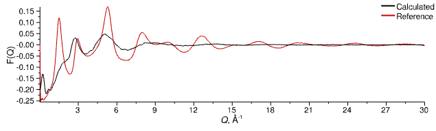

# Bulk Silica

## 4. Equilibrate the Box

To ensure that our silicon and oxygen atoms are well mixed and distributed we're going to "cook" the box at a high temperature to start with.

> **Bulk** configuration tab
{: .action .action_tabs}
> Change the **Temperature** to 10000.0
{: .action .action_edit}

Now we'll run for 250 steps

> Simulation &#8680; Run For...
{: .action .action_menu}
> Set the number of steps to 250 and click _OK_
{: .step}

You can open (double-click) the [`NeutronSQ`](../../userguide/modules/neutronsq) module in the _RDF / Neutron S(Q)_ layer to monitor the structure, or the [`Energhy`](../../userguide/modules/energy) module in the _Evolve (Basic Atomic)_ to check the energy as the simulation progresses. When finished, the F(Q) and G(r) should look a little like this:

_Calculated structure factor (black line) of amorphous silica at high temperature (10,000 K) compared to reference data at 298 K (red line)_

_Calculated total G(r) (black line) of amorphous silica at high temperature (10,000 K) compared to Fourier transform of reference data at 298 K (red line)_

We'll now reset the temperature of the box to 298 K and run a second equilibration.

> **Bulk** configuration tab
{: .action .action_tabs}
> Change the **Temperature** to 298.0
{: .action .action_edit}
> Simulation &#8680; Run For...
{: .action .action_menu}
> Set the number of steps to 250 and click _OK_
{: step}

Once finished, the structure should look a lot better:

_Equilibrated structure factor (black line) of amorphous silica compared to reference data at 298 K (red line)_

_Equilibrated total G(r) (black line) of amorphous silica compared to Fourier transform of reference data at 298 K (red line)_

[Previous Step](step3.md){: .btn }   [Next Step](step5.md){: .btn .right}
