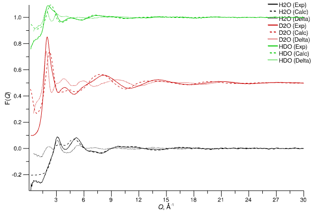

# Liquid Water

60 - 75 minutes
{: .label .label-blue }

## Summary

It should be no surprise that water is present in a significant fraction of disordered materials studies, owing to its importance to just about everything, and its presence just about everywhere! Here we'll set up, run, refine, and analyse the structure of liquid water at 298 K using three neutron scattering datasets measured on the SANDALS diffractometer at the ISIS Pulsed Neutron and Muon Source in 2001. This will illustrate most of the core workflows in Dissolve when applying it to the analysis of neutron scattering data, and is an excellent place to start if you're new to Dissolve and/or the analysis of disordered materials.

## Preparation

Download the example data file archive `Dissolve-X.Y.Z-ExampleData.zip` or `Dissolve-X.Y.Z-ExampleData.tar.gz` (where `X.Y.Z` will be the current version) from the [continuous build](https://github.com/trisyoungs/dissolve/releases/tag/continuous) in the releases section on GitHub if you haven't done so already.

> Open the Dissolve GUI
{: .action .action_dissolve}
> Choose **Empty Simulation** from the _Create_ section
{: .step}
> Save As...
{: .action .action_menu}
> Save your own input file under a sensible name in the `water` directory of the example data
{: .step}

Alternatively, download the data files listed below and save them to your location of choice.

- H2O: [SLS18498-H2O.mint01](https://raw.githubusercontent.com/trisyoungs/dissolve/develop/examples/water/data/SLS18498-H2O.mint01)
- HDO: [SLS18500-HDO5050.mint01](https://raw.githubusercontent.com/trisyoungs/dissolve/develop/examples/water/data/SLS18500-HDO5050.mint01)
- D2O: [SLS18502-D2O.mint01](https://raw.githubusercontent.com/trisyoungs/dissolve/develop/examples/water/data/SLS18502-D2O.mint01)

[Let's begin!](step1.md){: .btn }

## 1a. Draw the Molecule

We will draw our molecule using Dissolve's built-in editor:

> Species &#8680; Create... &#8680; Draw_
{: .action .action_menu}

A new editor window opens in which we can create our new species.

> Choose "Draw mode" from the toolbar above the species viewer - 
{: .action .action_mouse}
> Change the drawing element from `C` to `O` by clicking on the button next to 
{: .step}
> Left-click somewhere in the viewer below to place an oxygen atom
{: .step}
> Change the drawing element to hydrogen
{: .step}
> Left-click-drag from the existing oxygen atom to draw a hydrogen bound to it
{: .step}
> Repeat for the other hydrogen
{: .step}
> Click **OK** to close the editor and create the new species

Finally, let's rename it:

> Double-click on the new species tab's title and change the name to `Water`
{: .step}

{: .img-centre}
*A very badly drawn water molecule*

You'll now have a water molecule that might look like its gone ten rounds with Mike Tyson, so let's clean it up. First, we'll need to assign suitable forcefield terms.

> Species &#8680; Add Forcefield Terms
{: .action .action_menu}
> From the available forcefields choose `SPC/Fw` and click _Next_{: .text-green-100}
{: .step}
> For the atom types we want to _Assign all from Forcefield_{: .text-green-100}. For the intramolecular terms we want to assign them and reduce to master terms. Leave the settings as they currently are, and click _Next_{: .text-green-100}
{: step}
> There should be no conflicts with existing atom types or master terms, so click _Next_{: .text-green-100} then _Finish_{: .text-green-100} to exit the wizard.
{: .step}

Take a look at the _Contents & Forcefield_{: .text-green-100} section for the species and you'll see that we now have atom types assigned to our atoms, and suitable intramolecular terms assigned to the bonds and angle. Note that the functional forms of the interactions are actually the names of master terms, and are preceded with `@` to distinguish them as such (e.g. `@HW-OW-HW`). Master terms are global and can be referenced by one or more species, and are particularly useful when molecules possess high symmetry as there is no need to repeat the same parameter definitions. Furthermore, as we shall see later, adjusting species geometry by modifying the master terms is much easier than modifying all the individual values within a species.

We can now clean up the geometry of our molecule by doing a quick geometry optimisation.

> Click the "medic" icon in the species viewer toolbar - 
{: .action .action_mouse}

Do this a couple of times until there's no further appreciable change to the geometry of the molecule.

[Back to Overview](index.md){: .btn }   [Next Step](step1b.md){: .btn .right}
## 1b. Add Isotopologues

We have three experimental datasets in this example - H2O, D2O, and a 50:50 mix of the two. The natural isotopologue (H2O) is defined automatically by Dissolve, so we don't need to add it by hand. We will need to add a new one for D2O, but that is all. Mixtures (e.g. the H2O:D2O 50:50 sample) are created by blending isopologues, rather than defining specific isotopologues for the desired isotope ratios, and will be done when we set up the [`NeutronSQ`](../../userguide/modules/neutronsq) modules.

> **Species** tab, **Isotopologues** section
{: .action .action_tabs}
> Click _Add_{: .text-green-100}
{: .step}
> Expand the entries for the 'NewIsotopologue' by clicking the [+] next to its name, or by clicking _Expand All_{: .text-green-100}
{: .step}
> Change the isotope for the HW atom type from `Natural (bc = -3.739 fm)` to `2 (bc = 6.671)`
{: .step}
> Change the name of the isotopologue to 'Deuterated' (double-click on the name to do so)
{: .step}

> Exchangeable atoms are not specified in isotopologue definitions, but instead are indicated when using the isotopologues in modules.
{: .tip}

[Back to Overview](index.md){: .btn }   [Next Step](step2.md){: .btn .right}
## 1. Create a Water Species

Our first task is to create our water molecule species and give it a suitable forcefield description.

There are several ways to get atomic coordinates in to Dissolve, but since water is a simple molecule in this example we'll draw the molecule in the GUI itself.

We'll then set up the isotopologues we need to enable us to calculate the same weighted structure factors as those measured experimentally on the instrument.

[Back to Overview](index.md){: .btn }   [Next Step](step1a.md){: .btn .right}
## 2. Set up a Configuration

Time to create a suitable bulk water configuration for our simulation. We'll use the predefined "simple random mix" generator to get us going.

> Configuration &#8680; Create... &#8680; Simple random mix
{: .action .action_menu}
> Choose the water species and continue
{: .step}

We now need to set a few parameters in the generator in order to get the correct setup.

> Open the settings for the `Parameters` node
{: .action .action_settings}
> Check that the value of the "rho" variable is 0.1. This is the default value for the generator, and just so happens to correspond to the density (in atoms &#8491;-3) of liquid water at room temperature. The variable will be referenced in the `AddSpecies` node when setting the density of the water species.
{: .step}
> Open the settings for the `AddSpecies` node
{: .action .action_settings}
> Make sure that the units for the **Density** are set to `atoms/A3` and that the equation simple references our parameter `rho`.
{: .step}
> Increase the **Population** to 1000.
{: .step}
> Click _Regenerate_{: .text-green-100} to recreate the configuration with our adjusted parameters.
{: .action .action_mouse}

One thousand water molecules should have a cubic box size of just over 31 Angstroms side length.

Finally, we'll tweak the temperature of the configuration.

> Set the **Temperature** to 298 K
{: .action .action_edit}

{: .img-centre}
*Initial, randomised water box containing 1000 molecules*

[Previous Step](step1.md){: .btn }   [Next Step](step3.md){: .btn .right}
## 3. Set up Basic Processing

We'll now create two processing layers to handle the evolution of the configuration and the calculation of radial distribution functions and structure factors. 

### The Evolution Layer

We'll use the standard molecule evolution layer for our system:

> Layer &#8680; Create... &#8680; Evolution... &#8680; Standard Molecular (MC/MD)
{: .action .action_menu}

The new layer contains the following modules:

| Module | Purpose |
|--------|---------|
| [`MolShake`](../../userguide/modules/molshake) | Performs standard Monte Carlo moves on individual molecules |
| [`MD`](../../userguide/modules/md) | Performs a number of molecular dynamics steps, evolving the system according to Newton's equations of motion |
| [`Energy`](../../userguide/modules/energy) | Calculates the total energy of configurations |

Monte Carlo simulation via the [`MolShake`](../../userguide/modules/molshake) module will be the principal way our system moves and evolves, translating and rotating whole molecules but keeping the internal geometry of those molecules constant. The molecular dynamics run is critical for water (and, indeed, any molecular system) because it is this that will relax and evolve the intramolecular degrees of freedom in our molecules and give us realistic sampling of our bonds and angles. We don't need this to happen every iteration of the simulation, so the frequency of the [`MD`](../../userguide/modules/md) module is set to 5 by default.

### g(r) and Structure Factors

We have neutron-weighted experimental data, so we need a layer to calculate RDFs and neutron S(Q):

> Layer &#8680; Create... &#8680; Calculate... &#8680; RDF and Neutron S(Q)
{: .action .action_menu}

Since a [`NeutronSQ`](../../userguide/modules/neutronsq) module calculates the partial and total structure factors for a single isotopic composition, we will need to add two more since we have three reference datasets.

> Show the module palette for the layer by clicking the _Show Palette_{: .text-green-100} button at the top left of the tab.
{: .action .action_mouse}
> Drag a [`NeutronSQ`](../../userguide/modules/neutronsq) module from the _Module Palette_{: .text-green-100} on the left, placing it after the existing [`NeutronSQ`](../../userguide/modules/neutronsq) module. Alternatively, double-click the [`NeutronSQ`](../../userguide/modules/neutronsq) module in the _Module Palette_{: .text-green-100} to append one to the current list of modules.
{: .step}
> Add a second [`NeutronSQ`](../../userguide/modules/neutronsq) module, ensuring all three are **after** the [`RDF`](../../userguide/modules/rdf) module.
{: .step}

The [`NeutronSQ`](../../userguide/modules/neutronsq) module calculates the structure factors from existing radial distribution functions - it does not calculate these itself. This is the role of the [`RDF`](../../userguide/modules/rdf) module and, as such, it must be the first module in the list (i.e. be at the top).

Note that each of the new modules has a unique name - it is a requirement that modules within Dissolve can be uniquely identified by their name. We'll now give the modules sensible names that describe our three datasets, and set the isotopologues, reference data files, and instrumental broadening as necessary. The latter, for SANDALS, is described by a _Q_-dependent Gaussian with a FWHM of 0.02 &#8491;.

### H2O

> Click on the first the [`NeutronSQ`](../../userguide/modules/neutronsq) module (`NeutronSQ01`) to display its options
{: .action .action_mouse}
> Change its name from `NeutronSQ01` to `H2O`
{: .action .action_edit}
> Open the **Calculation** settings group
{: .action .action_groups}
> Set the **QBroadening** to `OmegaDependentGaussian` with a FWHM of 0.02
{: .step}
> Open the **Neutron Isotopes** settings group
{: .action .action_groups}
> Click the _Edit..._{: .text-green-100} button for the **Isotopologue** option
{: .step}
> Press the _Auto_{: .text-green-100} button to populate the list with the default isotopic selection for each species
{: .step}
> Open the **Reference Data** settings group
{: .action .action_groups}
> For the **Reference** keyword select the file `SLS18498-H2O.mint01` and set the format of the data to `mint`
{: .step}

> For generality, some of Dissolve's broadening functions refer to 'omega', which should be taken to mean the reciprocal space axis (in this case, 'Q').
{: .tip}

### D2O

> Click on the second the [`NeutronSQ`](../../userguide/modules/neutronsq) module (`NeutronSQ02`) to display its options
{: .action .action_mouse}
> Change its name from `NeutronSQ02` to `D2O`
{: .action .action_edit}
> Open the **Calculation** settings group
{: .action .action_groups}
> Set the **QBroadening** to `OmegaDependentGaussian` with a FWHM of 0.02
{: .step}
> Open the **Neutron Isotopes** settings group
{: .action .action_groups}
> Click the _Edit..._{: .text-green-100} button for the **Isotopologue** option
{: .step}
> Press the _Auto_{: .text-green-100} button to add the natural isotopologue for each species present
{: .step}
> Change the isotopologue from `Natural` to `Deuterated`
{: .step}
> Open the **Reference Data** settings group
{: .action .action_groups}
> For the **Reference** keyword select the file `SLS18502-D2O.mint01` and set the format of the data to `mint`
{: .step}

### HDO

The HDO sample is a little different in respect of the isotopologue specification. In order to get the 50:50 mix we will basically add two isotopologues for the water species - one H2O and one D2O. Each will have the same relative weighting of 1.0. Importantly, we must also tell the module that the `HW` atom type is exchangeable - otherwise, the weighting of the intramolecular terms will be incorrect.

> As a general rule, any alcoholic or amine hydrogen is exchangeable.
{: .tip}

When we set the isotopologues for our water molecule in the `HDO` sample they were added with equal weight (1.0 in both cases) which will result in the weighted structure factors _for that species_ reflecting a 50:50 mixture. Furthermore, we had to specify that the `HW` atom type is exchangeable. When a mixture of isotopologues that contain exchangeable atoms is present, if we do not tell Dissolve that this is the case the calculate intramolecular structure factors will be wrongly weighted as, in effect, we will simulate a mix of distinct H2O and D2O molecules, which in reality is not what was measured.

> Click on the third the [`NeutronSQ`](../../userguide/modules/neutronsq) module (`NeutronSQ03`) to display its options
{: .action .action_mouse}
> Change its name from `NeutronSQ03` to `HDO`
{: .action .action_edit}
> Open the **Calculation** settings group
{: .action .action_settings}
> Set the **QBroadening** to `OmegaDependentGaussian` with a FWHM of 0.02
{: .step}
> Open the **Neutron Isotopes** settings group
{: .action .action_settings}
> Click the _Edit..._{: .text-green-100} button for the **Isotopologue** option
{: .step}
> Press the _Auto_{: .text-green-100} button to add the natural isotopologue for each species present
{: .step}
> Select the entry for the water species, or its isotopologue, and click the _Add_{: .text-green-100} button to insert another isotopologue (the next unused isotopologue will be added - in this case, the `Deuterated` one).
{: .step}
> Click the button for the **Exchangeable** option
{: .step}
> Tick the `HW` atom type in the list
{: .step}
> Open the **Reference Data** settings group
{: .action .action_settings}
> For the **Reference** keyword select the file `SLS18502-HDO5050.mint01` and set the format of the data to `mint`
{: .step}

[Previous Step](step2.md){: .btn }   [Next Step](step4.md){: .btn .right}
## 4. Equilibrate the System

We're now in a position to run our initial equilibration of the system, so let's set the simulation running.

> Click the _Run_{: .text-green-100} button on the left-hand side of the main window
{: .action .action_mouse}
> Simulation &#8680; Run
{: .action .action_menu}
> Ctrl-R
{: .action .action_key}

It's useful to observe the energy of the configuration as we're equilibrating our system, since once this reaches a steady value we can begin to think about what to do next. We'll open up our [`Energy`](../../userguide/modules/energy) module in a separate tab so we can see the plot of the various energy components

> **Evolve (Standard)** tab
{: .action .action_tabs}
> Double-click on the [`Energy`](../../userguide/modules/energy) module to open its additional controls in a separate tab
{: .step}

You'll see several curves on the graph, including the total energy (black line) which is the sum of the internal (intramolecular) bond and angle and the intermolecular (i.e. Lennard-Jones plus coulomb) terms. The [`MD`](../../userguide/modules/md) module is set to only run if the total energy of the configuration is stable, but you should be able to notice when it kicks in as the bond (green line), angle (purple line), and total (blue) intramolecular energies which are constant during the Monte Carlo steps will suddenly drop to lower values. There will be some variation of the components up and down, but for a system of 1000 water molecules the total energy should approach a value of around -35&times;103 kJ mol-1 with the intermolecular energy around -44&times;103 kJ mol-1.

The energy will take a few hundred iterations to stabilise, so while we're waiting we'll take an initial look at the comparison between simulation and experiment in the next section.

[Previous Step](step3.md){: .btn }   [Next Step](step5.md){: .btn .right}
## 5. Assessing the Reference Potential

With our equilibrated (or equilibrating...) system we'll now make a basic comparison between our simulated total structure factors and the reference datasets.

> **RDF / Neutron S(Q)** tab
{: .action .action_tabs}
> Double-click on the `H2O` [`NeutronSQ`](../../userguide/modules/neutronsq) module to open its additional controls in a separate tab
{: .step}

Now we can see the comparison between the total radial distribution functions (top panel) and neutron-weighted structure factors (bottom panel) for the H2O sample. When the system is approaching equilibrium you should see something similar to this:

{: .img-centre}
*Equilibrated water (H2O) G(r)*
{: .img-centre}
*Equilibrated water (H2O) F(Q)*

At first glance the calculated and experimental F(Q) agree reasonably well, but the G(r) clearly show that we have a problem, with the peak for the O-H bond far too sharp and intense in the calculated data. This is less to do with inaccuracy of the intramolecular parameters present in the forcefield, and more to do with the apparent broadening of bound features caused by the relative speed of the probe particle to that of chemically-bound, vibrating atoms. To account for this difference we will apply an effective broadening function to the intramolecular g(r).

First, stop the simulation if it is running:

> Click the _Pause_{: .text-green-100} button on the left-hand side of the main window
{: .action .action_mouse}
> Simulation &#8680; Pause
{: .action .action_menu}
> Esc
{: .action .action_key}

Now we can safely adjust the options in the [`RDF`](../../userguide/modules/rdf) module:

> **RDF / Neutron S(Q)** tab
{: .action .action_tabs}
> Select th [`RDF`](../../userguide/modules/rdf) module to display its additional controls
{: .step}
> Open the **Calculation** settings group
{: .action .action_groups}
> Set the **IntraBroadening** to `Gaussian` with a FWHM of 0.18 (the default)
{: .step}

Start the simulation up again and you should see quite quickly that this broadening function brings the intensity of the first peak down to a level much more in line with the reference data:

{: .img-centre}
*Equilibrated water (H2O) G(r) with effective broadening applied to intramolecular g(r)*
{: .img-centre}
*Equilibrated water (H2O) F(Q) with effective broadening applied to intramolecular g(r)*

It's important to understand the difference between the two flavours of "calculated" G(r). The first (`Calculated (Direct)`, solid black line) is the G(r) calculated directly from the configuration, and with broadening applied, and represents the raw "simulated" G(r). The second (`Calculated (via FT)`, dashed black line) is derived from Fourier transform of the calculate total F(Q) (i.e. it is the Fourier transform of the Fourier transform of the G(r)). The reason for displaying the latter is to enable a more consistent comparison between experimental and calculated G(r) - the reference data is Fourier transformed from _Q_- to _r_-space usually with a Window function such as the Lorch function, and so we also use the same window function when transforming the calculated F(Q). Note that the effects are mostly isolated to the first peak in the G(r), which has a lower intensity in the Fourier transformed version.

[Previous Step](step4.md){: .btn }   [Next Step](step6.md){: .btn .right}
## 6. Fix the Water Molecule Geometry

There is a hint in the structure factors for the H2O sample (particularly the G(r)), that the intramolecular geometry of our off-the-shelf forcefield is not quite consistent with the real world.  This is made clearly obvious if you look at the G(r) for the D2O sample:

> **RDF / Neutron S(Q)** tab
{: .action .action_tabs}
> Double-click on the `D2O` [`NeutronSQ`](../../userguide/modules/neutronsq) module to open its additional controls in a separate tab
{: .step}

{: .img-centre}
*Equilibrated water (D2O) G(r) with effective broadening applied to intramolecular g(r)*

> You may notice a small 'upturn' in the calculated F(Q) for the D2O sample that does not match experiment. This is caused by subtle density fluctuations in the configuration that are accentuated by the deuteration of the water, and will disappear slowly over time. You can safely proceed with the example.
{: .warn}

Clearly we have a mismatch between the peak positions at around 1 &#8491; (related to the O-H bond) and 1.7 &#8491; (related to the H-O-H angle). It is usually necessary to adjust the geometry of your species a little in order to be consistent with the experimentally-measured data, and in the present case we are lucky that we only have two parameters to adjust!

> Here we are modifying the intramolecular terms based on comparison of the D2O data, but bear in mind that liquid water is amongst the systems most sensitive to isotopic substitution since all hydrogens are hydroxyl hydrogens, and subject to exchange as well as strong hydrogen bonding. As such, the differences in intramolecular geometry between H2O and D2O are measurable.[1]
{: .warn}

Since we set up our simulation to use intramolecular master terms (via the _Add Forcefield Terms..._{: .text-green-100} wizard) we can modify those to directly affect our water molecule's geometry.

> **Forcefield** tab, **Master Terms** section
{: .action .action_tabs}
> Change the bond length (_Parameter 2_) of the `HW-OW` bond term from 1.0 to 0.976.
{: .step}
> Change the equilibrium angle (_Parameter 2_) of the `HW-OW-HW` angle term from 113.24 to 107.134
{: .step}

Now run the simulation for a little longer and let the species adjust to their new geometry, and you should see a marked improvement in the comparison of the D2O total G(r) and structure factor.

{: .img-centre}
*Equilibrated water (D2O) G(r) with effective broadening and adjusted intramolecular geometry*

> The change in the G(r) will not be instant as the majority of the evolution of the system is from the [`MolShake`](../../userguide/modules/molshake) which does not change the intramolecular geometry. Only the [`MD`](../../userguide/modules/md) module will affect the intramolecular geometry. Also, the g(r) calculated by the [`RDF`](../../userguide/modules/rdf) are averaged over five calculations by default.
{: .tip}

It's also worth checking the other two samples, where the same kind of improvement should be noticeable (if a little less prominent).

### References
1. [Quantum Differences between Heavy and Light Water](https://journals.aps.org/prl/abstract/10.1103/PhysRevLett.101.065502), A. K. Soper and C. J. Benmore, Phys. Rev. Lett. **101**, 065502 (2008).

[Previous Step](step5.md){: .btn }   [Next Step](step7.md){: .btn .right}
## 7. Set up Potential Refinement

Let's briefly recap what we've done so far:

1. Set up a liquid water system based on a literature forcefield (`SPC/Fw`)
2. Equilibrated the system and made an initial structural comparison with experimental data
2. Adjusted the intramolecular geometry of the water molecule in order to better match the experimental data

Our agreement with experiment is OK, but it is possible to make it even better by modifying the _inter_-atomic interaction parameters contained in the atom types. However, generally this is not to be attempted by hand in all but the simplest of cases, as the effects of adjusting the interatomic are seldom as obvious as those for _intra_-molecular parameters. Also, for even a modestly-complicated system the number of adjustable parameters is simply too large to tackle with manual fitting.

Here we'll employ the [`EPSR`](../../userguide/modules/epsr) module in order to adjust the interatomic potentials automatically to give better agreement with the experimental reference data.

> Layer &#8680; Create... &#8680; Refinement... &#8680; Standard EPSR
{: .action .action_menu}

Our new layer contains only the [`EPSR`](../../userguide/modules/epsr) module, and which Dissolve has set up with sensible targets and defaults. Double-click the [`EPSR`](../../userguide/modules/epsr) module to open it up as a tab - we'll need to explore the various graphs as we proceed, but for now let's check the set-up of the module.

> **Refine (EPSR)** tab
{: .action .action_tabs}
> Double-click on the [`EPSR`](../../userguide/modules/epsr) module to open it up in a new tab
{: .action .action_mouse}
> Open the **Calculation** settings group
{: .action .action_groups}
> An initial value for **EReq** has been set (3.0) - this determines the magnitude or "strength" of the generated interatomic potentials
{: .step}
> The **Feedback** factor is 0.8 - this states that we are 80% confident in the experimental data, and that the calculated partial structure factors should make up 20% of the estimated partials
{: .step}
> The range of data over which to generate the potential in _Q_-space is determined by **QMax** (30 &#8491;-1)and **QMin** (0.5 &#8491;-1)
{: .step}
> The experimental data to use in the refinement are set in the **Target** option, which lists all available modules by name that have suitable data for the [`EPSR`](../../userguide/modules/epsr) module to use. All of the [`NeutronSQ`](../../userguide/modules/neutronsq) modules have been selected automatically
{: .step}

All of these default values are fine for our purpose, and there's very little that you should have to change in the first instance. So, start the simulation running again to begin the refinement process, and while it's running we'll go through the different tabs in the [`EPSR`](../../userguide/modules/epsr) module one by one to see what information we have available, and which help to illustrate the basic workflow of the EPSR methodology.

### 1. F(Q)

Basic comparison between reference experimental data (solid lines) defined in [`NeutronSQ`](../../userguide/modules/neutronsq) module **Target**s and those simulated by Dissolve (dashed lines), including the difference functions (dotted lines).

{: .img-centre}
*Experimental, calculated, and difference functions for data targeted by the EPSR module*

### 2. F(Q) Delta/Fit

Delta functions between experiment and simulation are repeated here in negated form, and shown along with the fits to the functions achieved by the Poisson / Gaussian sums.

{: .img-centre}
*Delta functions (negated) and the Poisson/Gaussian fits to those functions*

### 3. Estimated S(Q)

Estimated (**not** experimental) partial structure factors (solid lines) derived from combining experimental F(Q) and the calculated partial S(Q) (shown as dashed lines).

{: .img-centre}
*Estimated partial structure factors*

### 4. Estimated g(r)

Partial radial distribution functions for each atom type pair in the system, showing estimated partials (solid lines, calculate by Fourier transform of the estimated S(Q)) and those from the simulation (dashed lines, calculated by Fourier transform of the simulated partial g(r)).

Note that the estimated g(r) from the combination of the experimental and simulated data are _intermolecular_ partials - i.e. they contain no contributions from _intramolecular_ terms related to the intramolecular bonding. The simulated partial g(r) (dashed lines), however, are the full simulated partials include both intermolecular and intramolecular terms. The reason for this is to aid in detection of cases where the intramolecular structure of the molecules in the simulation is significantly different from that measured experimentally, which would manifest as small features in the estimated g(r) at or around the _r_-values associated to bond or angle (1,3) distances.

{: .img-centre}
*Estimated partial radial distribution functions*

### 5. Total G(r)

Neutron weighted total G(r) from Fourier transform of the reference data (solid line) and Fourier transform of the simulated dat (dashed line). The reason for displaying the latter rather than the G(r) calculated directly in _r_-space is to provide for a consistent comparison between simulation and experiment given the necessity of performing Fourier transforms (truncation errors are worse in _Q_-space data, so transforming to _Q_ to _r_ demands more judicious use of window functions in the transform).

{: .img-centre}
*Total radial distribution functions from Fourier transform of reference and simulated F(Q) data*

### 6. &phi;(r)

&phi;(r) represent the empirical potentials generated from the difference data, one per pair potential.

{: .img-centre}
*Empirical potentials for each atom type pair (i.e. each distinct pair potential)*

### 7. R-factor

The upper panel shows the evolution of the current potential magnitude (whose limit is guided by the value of **EReq**). In the lower panel, for each experimental dataset the "goodness of agreement" with simulation is represented by the r-factor, and the total (average) r-factor across all datasets.

{: .img-centre}
*R-factors for experimental (reference) datasets*

### 8. Debug

Safe to say that you can probably ignore this one!

[Previous Step](step6.md){: .btn }   [Next Step](step8.md){: .btn .right}
## 8. Managing the Refinement

Now that our simulation is running and happily refining interatomic potentials, it's fair to ask "How long should I refine for?", or "What limit of **EReq** should I use?", or even "How do I know when I've achieved the best agreement with experiment that I can get?". The somewhat vague answer to all these questions is "When you can't make the simulation any better." Simply giving the [`EPSR`](../../userguide/modules/epsr) module the freedom to do anything with a large **EReq** value is not a sensible approach, since it is highly likely that increasing the magnitude of the empirical potentials too much will harm the simulation rather than do it good. Unfortunately there is no direct way to determine what value of **EReq** is optimal _a priori_, and so some degree of trial and error is involved.

The EPSR algorithm implemented within Dissolve doesn't contain any attempts at automating the adjustment of **EReq**, so a general procedure to follow is:

1. Set a modest (i.e. low) value of **EReq** to begin with (the default of 3.0 is enough for neutral molecules, but should be higher for ionic systems).
2. Run the simulation and observe the progression of the r-factors (hopefully they should decrease from their initial starting values).
3. Once the r-factors have stabilised, increase **EReq** (increasing by an amount equivalent to the initial value each time is sensible).
4. If the r-factors decrease again, repeat (3). If not, then you have probably reached the limit of what is possible within the context of the current simulation and its forcefield.

If you now take a look at the r-factors for your water simulation you should see that they have steadily decreased while you've been reading. In fact, an **EReq** value of around 5 or 6 represents the "limit of no improvement", so let's pause the simulation step up to that value now:

> Pause the simulation with **Esc**
{: .step .action_key}
> **Refine (EPSR)** tab
{: .action .action_tabs}
> Open the **Calculation** settings group
{: .action .action_groups}
> Set **EReq** to 6.0
{: .step}
> Start the simulation running again with **Ctrl-R**
{: .step .action_key}

Now that we're running again with a higher value of **EReq** the r-factors should start to come down again, and with a value of 6.0 the total r-factor should soon approach a value of around 1.55&times;10-4. The simulated F(Q) should now agree pretty well with the experimental data:

{: .img-centre}
*Experimental (solid lines) and simulated (dashed lines) total F(Q) after refinement*

We can observe some discrepancies at the low _Q_ end of the data, but there is little that we can do to remedy these errors since they are likely due to imperfect subtraction of inelasticity effects in the processing of the original data. Simulated F(Q) (even un-refined ones) often give a good indication of what the experimental data "should look like", especially in the region where inelasticity effects dominate, and can be useful in guiding data processing (e.g. with Gudrun).

At this point, we can start to think about what kind of structural properties we want to calculate from our refined simulation.

[Previous Step](step7.md){: .btn }   [Next Step](step9.md){: .btn .right}
## 9a. Centre-of-Mass RDF

Examining the centre-of-mass RDF between molecules is often useful since it gives a general picture of the arrangement between molecule. A related quantity is the coordination number, i.e. the number of molecules within solvation shells that typically form around molecules in the liquid. Here we'll set up calculation of the centre-of-mass RDF and the associated coordination number for the first solvation shell. Dissolve provides a predefined layer to calculate both at once, however first we need to define a suitable site - the centre of mass of the water molecule.

### Define the Centre-of-Mass Site

If you don't already have a site `COM` representing the centre-of-mass of the molecule, perform the following steps:

> **Water** species tab
{: .action .action_tabs}
> Open the **Analysis Sites** section
{: .step}
> Click **[+] Add** to create a new site
{: .step}
> In the species viewer to the right, click-drag with the left mouse button and draw a box around all three atoms of the water molecule to select them.
{: .action .action_mouse}
> Click the **Origin** button in the toolbar of the viewer to set the currently-selected atoms as defining the origin
{: .step}
> Select the **Weight by mass** option in the **Origin Atom(s)** section
{: .step}
> Double-click on the new site in the list and change its name to `COM`
{: .action .action_edit}

You'll see the site represented in the species viewer as a 3D crosshair indicating the coordinates of the origin, surrounded by a small cube. 

### Create an Analysis Layer

We'll now create one of Dissolve's predefined layers to give us the processing modules we need:

> Layer &#8680; Create... &#8680; Analysis... &#8680; RDF & Coordination Number
{: .action .action_menu}

The new layer contains the following modules:

| Module | Purpose |
|--------|---------|
| [`CalculateRDF`](../../userguide/modules/calculaterdf) | Calculates the radial distribution function between two specified sites |
| [`CalculateCN`](../../userguide/modules/calculatecn) | Calculates a coordination number by summing histogram data calculated by a [`CalculateRDF`](../../userguide/modules/calculaterdf) module |

We'll need to set up both of these modules to calculate exactly what we need.  First, [`CalculateRDF`](../../userguide/modules/calculaterdf).

> Select the [`CalculateRDF`](../../userguide/modules/calculaterdf) module to display its options
{: .action .action_mouse}
> Open the **Sites** settings group
{: .action .action_groups}
> Press the button for **SiteA** and choose the `COM` site
{: .step}
> Select the `COM` site for **SiteB** as well
{: .step}
> Enable the **ExcludeSameMolecule** option
{: .step}

Since we are considering the RDF of one type of site around itself, the **ExcludeSameMolecule** option prevents consideration of the same site with itself (which would give a distance of zero and result in a large undesirable spike at the beginning of the RDF). The distance range over which to calculate the RDF can be set in the **Calculation** settings group, but the defaults (0 - 10 &#8491; with a step size of 0.05 &#8491;) are fine for what we need.

Now the [`CalculateCN`](../../userguide/modules/calculatecn) module:

> Select the [`CalculateCN`](../../userguide/modules/calculatecn) module to display its options
{: .action .action_mouse}
> Open the **Target / Ranges** settings group
{: .action .action_groups}
> Set the maximum for **RangeA** to 3.4 &#8491;
{: .step}

The [`CalculateCN`](../../userguide/modules/calculatecn) module calculates up to three separate coordination numbers over different distance regions of the target RDF, but we will focus on the first coordination shell in this example. The target RDF is taken from a [`CalculateRDF`](../../userguide/modules/calculaterdf) module, specified by the **SourceRDF** keyword (this was been automatically set to be the [`CalculateRDF`](../../userguide/modules/calculaterdf) module in the current layer).

[Previous Step](step9.md){: .btn }   [Next Step](step9b.md){: .btn .right}
## 9b. Hydrogen Bond Geometry

Water is the archetypal hydrogen bonding fluid, and so it makes sense to analyse the hydrogen bonding contacts within the fluid. We will be principally interested in the geometry of O&ndash;H&middot;&middot;&middot;O contacts occurring in the liquid in terms of the H&middot;&middot;&middot;O distance and the O&ndash;H&middot;&middot;&middot;O angle.

### Define Atomic Sites

We'll need simple atomic sites for the oxygen and each of the hydrogen atoms in our water molecule, so let's create them now:

> **Water** species tab
{: .action .action_tabs}
> Open the **Analysis Sites** section
{: .step}
> Click-drag with the left mouse button in the species viewer and draw a box around the oxygen atom to select it
{: .action .action_mouse}
> Click the **Create** button in the viewer toolbar to create the new site (which will be called `O`)
{: .step}
> Repeat this for each hydrogen atom individually, naming those sites `H1` and `H2`
{: .step}

### Create the Analysis Layer

Let's now create a new layer and add the analysis module that we want:

> Layer &#8680; Create... &#8680; Empty
{: .action .action_menu}
> Rename the layer by double-clicking on the tab name, and change it to `Analyse HBond`
{: .action .action_edit}
> Show the module palette for the layer by clicking the _Show Palette_{: .text-green-100} button at the top left of the tab.
{: .action .action_mouse}
> Drag a [CalculateDAngle](../../userguide/modules/calculatedangle) module over to the **Current Modules** list
{: .step}

As its name suggests, the [CalculateDAngle](../../userguide/modules/calculatedangle) module calculates distance and angle histograms, and their 2D map, from three target sites. Since the module is general-purpose, we'll need to set up the module to give us information on our specific geometry of interest. The [CalculateDAngle](../../userguide/modules/calculatedangle) assumes in the target interaction A&ndash;B&middot;&middot;&middot;C that A&ndash;B occur on the same molecule, and gives us a choice as to whether we exclude C sites that are also on the same molecule.

> Select the [`CalculateDAngle`](../../userguide/modules/calculatedangle) module to display its options
{: .action .action_mouse}
> Open the **Calculation** settings group
{: .action .action_groups}
> Change the maximum value of the **DistanceRange** to 5.0 &#8491;
{: .step}
> Open the **Sites** settings group
{: .action .action_groups}
> Press the button for **SiteA** and choose the `O` site
{: .step}
> For **SiteB** select both the `H1` and `H2` sites
{: .step}
> For **SiteC** choose the `O` site
{: .step}
> Enable the **ExcludeSameMolecule** to ignore interactions where site C is on the same molecule as A and B.
{: .step}

[Previous Step](step9a.md){: .btn }   [Next Step](step9c.md){: .btn .right}
## 9c. Centre-of-Mass Spatial Density

Radial distribution functions provide a spherically-averaged picture of structural correlations between sites, so when there are strongly directional interactions (such as hydrogen bonds, for instance) or simply where the central molecule of interest lacks symmetry, understanding the distribution of other sites in 3D space around a given molecule type is much more informative. A spatial distribution function or spatial density function (SDF) tells us, in a manner analogous to the radial distribution function, the densities of some object in 3D space relative to the bulk density. In other words, given a central molecule, the SDF tells us where other molecules or sites prefer to locate themselves.

The SDF is an "orientation-dependent" function - rather than averaging spherically around a molecule as in the RDF, the SDF preserves spatial information relative to some reference set of axes related to the local geometry of the central molecule. So, our first task is to define a set of reference axes for our water molecule.

### Set Up Site Axes

We will define axes on our centre-of-mass site. In general, a system of reference axes can be constructed quite easily from the following steps:

1. Define a coordinate that will represent the origin of the axes (i.e. the local coordinate {0,0,0}). In the present example this will be the centre-of-mass of the molecule.
2. Select a group of one or more atoms whose coordinates, when averaged, will define absolutely the direction of the _x_ axis.
3. Select a group of one or more atoms whose coordinates, when averaged, will define the rough direction of the _y_ axis (and more importantly the XY plane), and which will be orthogonalised into the proper _y_ axis.
4. Define the _z_ axis from the cross product of the _x_ and _y_ axes.

When defining a site within Dissolve it is your responsibility to provide atom indices for the origin and the representative _x_ and _y_ directions - Dissolve will do the rest. Thus:

> **Water** species tab
{: .action .action_tabs}
> Open the **Analysis Sites** section
{: .step}
> If you don't already have the `COM` site, click-drag with the left mouse button in the species viewer and draw a box around the whole molecule to select it, then press the **Create** button in the toolbar, and rename the new site to `COM`.
{: .action .action_mouse}
> Make sure the `COM` site is selected in the list on the left
{: .step}
> Select the oxygen atom and click the **X Axis** button in the viewer toolbar
{: .action .action_mouse}
> Select either one of the hydrogen atoms and click the **Y Axis** button in the viewer toolbar
{: .action .action_mouse}

You'll note that, as soon as you pressed the **Y Axis** button a set of axes appeared in the site viewer, letting you know that your definition is complete and showing you how your system of axes are oriented.

### Create the Analysis Layer

We will add another of Dissolve's predefined analysis layers to get the modules that we want:

> Layer &#8680; Create... &#8680; Analysis... &#8680; Average Molecule & SDF
{: .action .action_menu}

Along with the actual calculate of the SDF, it is useful to have the actual average geometry of the species around the specified site, and so the layer provides the following modules:

| Module | Purpose |
|--------|---------|
| [`CalculateAvgMol`](../../userguide/modules/calculateavgmol) | Calculates the average geometry of the parent species aroudn a specified reference site |
| [`CalculateSDF`](../../userguide/modules/calculatesdf) | Calculates the spatial density function of a particular site around a central reference site |

As the name implies, the [`CalculateAvgMol`](../../userguide/modules/calculateavgmol) module will provide us with the average species geometry which we can use as a reference when we plot the spatial density function calculated from the [`CalculateSDF`](../../userguide/modules/calculatesdf) module. The [`CalculateSDF`](../../userguide/modules/calculatesdf) module takes two sites as input - the central site A about which the distribution of site B will be calculated. For both module, the principal (central) site must have a system of axes defined.

Let's proceed and set up the two modules in the layer:

> Select the [`CalculateAvgMol`](../../userguide/modules/calculateavgmol) module to display its options
{: .action .action_mouse}
> Open the **Target** settings group
{: .action .action_groups}
> Set the target **Site** for the average molecule calculation to be `COM` (it will be the only one available, since it is the only one which has a set of axes defined)
{: .step}
> Select the [`CalculateSDF`](../../userguide/modules/calculatesdf) module to display its options
{: .action .action_mouse}
> Open the **Sites** settings group
{: .action .action_groups}
> Set the central **SiteA** to `COM` (again, the only one available)
{: .step}
> Set the surrounding **SiteB** to `O`
{: .step}

[Previous Step](step9b.md){: .btn }   [Next Step](step10.md){: .btn .right}
## 9. Setting up Analysis

Having now generated and refined a simulation so that it is consistent with experimental data, we can finally get round to the main goal of any total scattering experiment - understanding the structure of the system. Exactly what questions you want to ask depends on the what you really want to know about your system, and what analysis you will want to run on your simulation.

The process of refining a simulation against experimental structure factors means that we already have access to the atomic partial and total radial distribution functions. However, usually there are more interesting properties to know - for liquid water, we may wish to know the centre-of-mass radial distribution function (i.e. a g(r) between molecules) instead. We may want to quantify the geometry of the hydrogen bond interactions in the system, or we might be interested in the three-dimensional distribution of water molecules about a central, reference water molecule. The final "production" stage involves calculating these quantities and drawing some meaningful conclusions from them.

To achieve this we need to define one or more 'sites' on our water molecule. Sites are used in all of Dissolve's analysis routines, and represent specific atoms, or averages of collections of atoms to be used as points of reference in the calculation of quantities. There are built-in analysis modules to calculate common quantities of interest, but Dissolve also allows custom analysis routines to be defined. Here, we shall only concern ourselves with Dissolve's built-in functionality.

### Defining Sites

Sites are defined within species and basically represent instructions for calculating a reference point (and possibly axes) for any molecule of that type in the simulation. Sites can be found on the relevant species tab:

> Pause the simulation with **Esc**
{: .step .action_key}
> **Water** species tab
{: .action .action_tabs}
> Open the **Analysis Sites** section
{: .step }

You'll see in this section a list of defined sites (currently none) for your water species, along with a viewer of the species on the right which can be used to interactively select atoms for the site origin, or to define axes. It also illustrates the position and, if defined, the axes for the site.

### Next Steps

The following subsections will describe how to set up several flavours of analysis in separate layers. Feel free to add all of them, or just a selection, to your simulation before moving on to [Step 10](step10.md) and starting it up again to see the results.

[Previous Step](step8.md){: .btn }   [Next Step](step9a.md){: .btn .right}

## 10. Running the Analysis

With our analysis modules set up we are now ready to restart the simulation and begin calculating the quantities we requested - we'll call this our "production run". There are a couple of things to note at this point:

1. The [EPSR](../../userguide/modules/epsr) module / layer should remain enabled during the production run in order to maintain the simulation in its present state.
2. All quantities calculated from analysis modules are averaged automatically over time.
3. Simple quantities (e.g. radial distribution functions) tend to accumulate statistics quickly (in a small number of iterations) while more complicated quantities (e.g. spatial distribution functions) will take much longer to give a useful average.

When you're ready, restart the simulation and we can look at the quantities start to form as the data accumulates. Brief overviews of what to expect are given below.

### Centre-of-Mass RDF

We can use the [CalculateCN](../../userguide/modules/calculatecn) module graphs to view both the centre-of-mass RDF and the associated coordination number.

> **Analyse RDF/CN** tab
{: .action .action_tabs}
> Double-click the [CalculateCN](../../userguide/modules/calculatecn) module to open it in a new tab
{: .step}

The source radial distribution function is shown in the graph and exhibits a strong peak at around 2.8 &#8491; for the COM&ndash;COM distance in the liquid. Integrating the curve up to the first minimum (3.4 &#8491;) gives us a first shell coordination number of around 4.7 molecules (displayed in the panel above the graph).

> Is the coordination number of 4.7 realistic?
{: .question}

### Hydrogen Bond Geometry

Open the [CalculateDAngle](../../userguide/modules/calculatedangle) module to see the RDF, angle histogram, and 2D map.

> **Analyse HBond** tab
{: .action .action_tabs}
> Double-click the [CalculateDAngle](../../userguide/modules/calculatedangle) module to open it in a new tab
{: .step}

There are three graphs on display here - the B&middot;&middot;&middot;C g(r) (top left), the A&ndash;B&middot;&middot;&middot;C angle histogram (bottom left), and the 2D correlation map of the two (right). The B&middot;&middot;&middot;C g(r) corresponds to the intermolecular H&middot;&middot;&middot;O and you should see the principal hydrogen bonding peak at 1.8 &#8491; followed by a second, broader interaction at 3.3 &#8491;. So, the primary hydrogen bonding distance in the liquid is 1.8 &#8491;, but how directional is this interaction? If we look at the distance-angle map and read off the x axis to 1.8 &#8491; we can see that the A&ndash;B&middot;&middot;&middot;C angle is always between 150 and 180&deg;. In other words, a very directional hydrogen bond! Angles associated to the broader feature at 3.3 &#8491 are around 60&deg;.

> What causes the broad feature at feature at 3.3 &#8491; / 60&deg;?
{: .question}

### Hydrogen Bond Geometry

Open the [CalculateSDF](../../userguide/modules/calculatesdf) module to see the spatial distribution function - we will need to set the central reference molecule to the average molecule we also requested, and adjust the cutoff to get a sensible surface.

> Cutoffs for the surface display are given in terms of the number density per cubic &#8491; of the surrounding molecule / site in the simulation box. In the present example, the number density of water molecule centres is **1000 &divide; 31.07233 = 0.033**. The cutoff we will set below therefore gives a surface that represents the positions of molecules approximately twice the bulk density of water molecules.
{: .tip}

> **Analyse AvgMol/SDF** tab
{: .action .action_tabs}
> Double-click the [CalculateSDF](../../userguide/modules/calculatedsdf) module to open it in a new tab
{: .step}
> Set the **Reference Molecule** to `COM@Water (AvgMol)`
{: .step}
> Change the **Lower** cutoff to 0.065
{: .step}

Spatial density functions take a relatively long to accumulate to a point where the surfaces are smooth, but you should be able to make out the salient features after only a handful of iterations. Along each O&ndash;H bond vector there exists a small lobe of density, and represents the positions of molecules acting as hydrogen bond acceptors to the central one (this visually represents the distance and angle we found in the [CalculateDAngle](../../userguide/modules/calculatedangle) results above). A halo of density also exists around the oxygen atom, representing the positions of molecules acting as hydrogen bond donors to the central one.

[Previous Step](step9.md){: .btn }   [Back to Index](index.md){: .btn .right}
