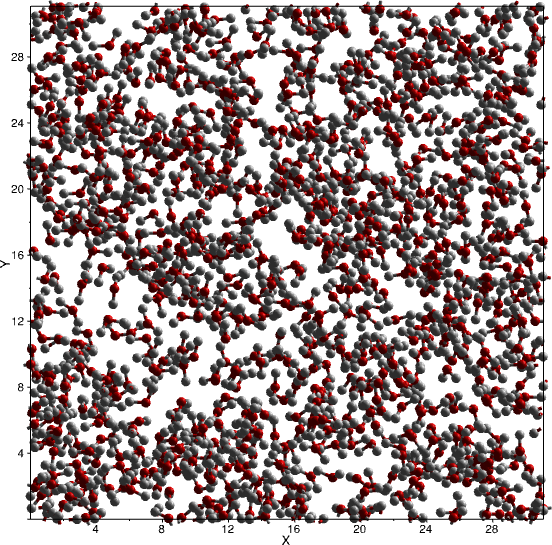

# Liquid Water

## 2. Set up Basic Processing

We'll now create two processing layers to handle the evolution of the configuration and the calculation of radial distribution functions and structure factors.

Go to _Layer→Create...→Evolution...→Standard Molecular (MC/MD)_{: .text-green-100} in the main menu to produce our evolution layer. The default settings will give us what we need, which is molecular Monte Carlo every iteration of the main loop, and a short Molecular Dynamics run every five iterations. The latter is particularly important as this will give intramolecular variety to the molecules - if it were not present, every water molecule would have exactly the same geometry, and this is most definitely not what we want.

Now we can add a calculation layer - choose _Layer→Create...→Evolution...→Standard Molecular (MC/MD)_{: .text-green-100} from the main menu to add a new layer containing [`RDF`](/modules/rdf) and [`NeutronSQ`](/modules/neutronsq) modules. Each [`NeutronSQ`](/modules/neutronsq) module calculates structure factors for a specific isotopic composition - we have three reference datasets, H2O, D2O, and a 50:50 mix, so we'll need to add two more [`NeutronSQ`](/modules/neutronsq) modules to the layer. From the _Palette_ on the left of the layer display, drag two more [`NeutronSQ`](/modules/neutronsq) modules on to the palette, ensuring that all three occur after the [`RDF`](/modules/rdf) module.

{: .text-green-100} to 298 K.

{: .img-centre}

[Previous Step](step2.md){: .btn }   [Next Step](step4.md){: .btn .right}
