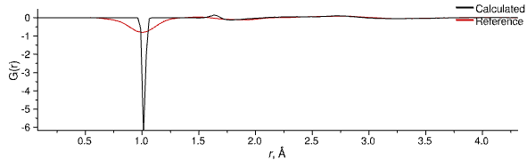
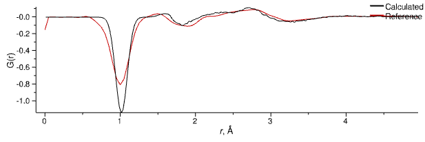
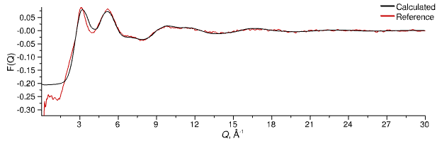

# Liquid Water

## 5. Assessing the Reference Potential

With our equilibrated (or equilibrating...) system we'll now make a basic comparison between our simulated total structure factors and the reference datasets.

> **RDF / Neutron S(Q)** tab
{: .action .action_tabs}
> Double-click on the `H2O` [`NeutronSQ`](/userguide/modules/neutronsq) module to open its additional controls in a separate tab
{: .step}

Now we can see the comparison between the total radial distribution functions (top panel) and neutron-weighted structure factors (bottom panel) for the H2O sample. When the system is approaching equilibrium you should see something similar to this:

{: .img-centre}
*Equilibrated water (H2O) G(r)*
{: .img-centre}
*Equilibrated water (H2O) F(Q)*

At first glance the calculated and experimental F(Q) agree reasonably well, but the G(r) clearly show that we have a problem, with the peak for the O-H bond far too sharp and intense in the calculated data. This is less to do with inaccuracy of the intramolecular parameters present in the forcefield, and more to do with the apparent broadening of bound features caused by the relative speed of the probe particle to that of chemically-bound, vibrating atoms. To account for this difference we will apply an effective broadening function to the intramolecular g(r).

First, stop the simulation if it is running:

> Click the _Pause_{: .text-green-100} button on the left-hand side of the main window
{: .action .action_mouse}
> Simulation &#8680; Pause
{: .action .action_menu}
> Esc
{: .action .action_key}

Now we can safely adjust the options in the [`RDF`](/userguide/modules/rdf) module:

> **RDF / Neutron S(Q)** tab
{: .action .action_tabs}
> Select th [`RDF`](/userguide/modules/rdf) module to display its additional controls
{: .step}
> Open the **Calculation** settings group
{: .action .action_groups}
> Set the **IntraBroadening** to `Gaussian` with a FWHM of 0.18 (the default)
{: .step}

Start the simulation up again and you should see quite quickly that this broadening function brings the intensity of the first peak down to a level much more in line with the reference data:

{: .img-centre}
*Equilibrated water (H2O) G(r) with effective broadening applied to intramolecular g(r)*
{: .img-centre}
*Equilibrated water (H2O) F(Q) with effective broadening applied to intramolecular g(r)*

It's important to understand the difference between the two flavours of "calculated" G(r). The first (`Calculated (Direct)`, solid black line) is the G(r) calculated directly from the configuration, and with broadening applied, and represents the raw "simulated" G(r). The second (`Calculated (via FT)`, dashed black line) is derived from Fourier transform of the calculate total F(Q) (i.e. it is the Fourier transform of the Fourier transform of the G(r)). The reason for displaying the latter is to enable a more consistent comparison between experimental and calculated G(r) - the reference data is Fourier transformed from _Q_- to _r_-space usually with a Window function such as the Lorch function, and so we also use the same window function when transforming the calculated F(Q). Note that the effects are mostly isolated to the first peak in the G(r), which has a lower intensity in the Fourier transformed version.

[Previous Step](step4.md){: .btn }   [Next Step](step6.md){: .btn .right}
