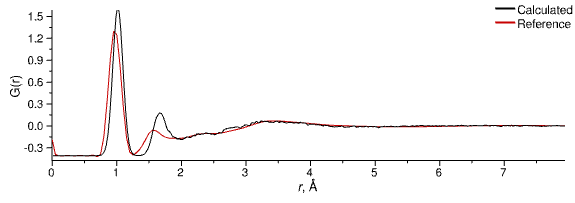

# Liquid Water

## 6. Adjust Intramolecular Geometry

There is a hint in the structure factors, and particularly the G(r), that the intramolecular geometry of our off-the-shelf forcefield for water is not quite consistent with the real world.  This is made clearly obvious if you look at the G(r) for the D2O sample:

{: .img-centre}

> You may notice a small 'upturn' in the calculated F(Q) for the D2O sample that does not match experiment. This is caused by subtle density fluctuations in the configuration that are accentuated by the deuteration of the water, and will disappear slowly over time. You can safely proceed with the example.
> {: .warn}

Clearly we have a mismatch between the peak positions at around 1 &#8491; (related to the O-H bond) and 1.7 &#8491; (related to the H-O-H angle). It is usually necessary to adjust the geometry of your species a little in order to be consistent with the experimentally-measured data, and in the present case we are lucky that we only have two parameters to adjust!

> Here we are modifying the intramolecular terms based on comparison of the D2O data, but bear in mind that liquid water is amongst the systems most sensitive to isotopic substitution since all hydrogens are hydroxyl hydrogens, and subject to exchange as well as strong hydrogen bonding. As such, the differences in intramolecular geometry between H2O and D2O are measurable.[1]
{: .warn}

Since we set up our simulation to use intramolecular master terms (via the _Add Forcefield Terms..._{: .text-green-100} wizard) we can modify those to directly affect our species.

> **Forcefield** tab, **Master Terms** section
{: .action .action_tabs}
> Change the bond length (_Parameter 2_) of the `HW-OW` bond term from 1.0 to 0.976.
{: .step}
> Change the equilibrium angle (_Parameter 2_) of the `HW-OW-HW` angle term from 113.24 to 107.134
{: .step}

Now run the simulation for a little longer and let the species adjust to their new geometry, and you should see a marked improvement in the comparison of the D2O total G(r) and structure factor.

> The change in the G(r) will not be instant as the majority of the evolution of the system is from the [`MolShake`](/userguide/modules/molshake) which does not change the intramolecular geometry. Only the [`MD`](/userguide/modules/md) module will affect the intramolecular geometry. Also, the g(r) calculated by the [`RDF`](/userguide/modules/rdf) are averaged over five calculations by default.
{: .tip}

It's also worth checking the other two samples, where the same kind of improvement should be noticeable (if a little less prominent).

### References
1. [Quantum Differences between Heavy and Light Water](https://journals.aps.org/prl/abstract/10.1103/PhysRevLett.101.065502), A. K. Soper and C. J. Benmore, Phys. Rev. Lett. **101**, 065502 (2008).

[Previous Step](step5.md){: .btn }   [Next Step](step7.md){: .btn .right}
