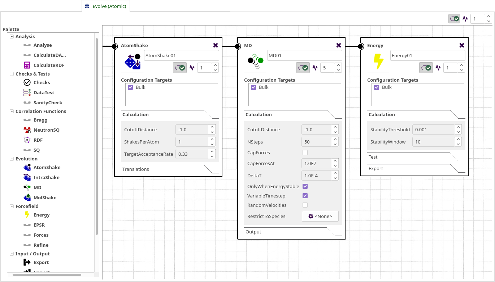

# Modules

## Overview

Modules perform most of the interesting and important functionality present within Dissolve, covering methods to move atoms around, calculation of structure factors and radial distribution functions, and the analysis of configurations amongst other things.

## Using Modules

Modules exist within "layers" (often referred to as "processing layers") defined in the main Dissolve simulation, or in layers local to specific configurations. Constructing a simple simulation is a matter of creating a layer from the GUI, dragging the modules you want on to it (from the module palette on the left) and adjusting the settings of each module to suit.

{: .img-centre}

## Anatomy of a Module

{: .img-centre}
